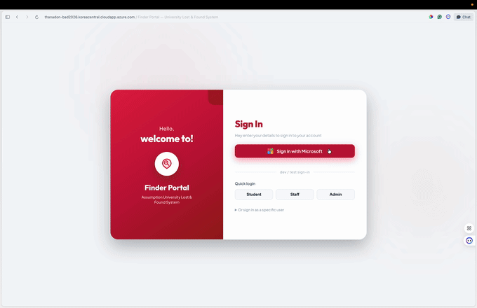
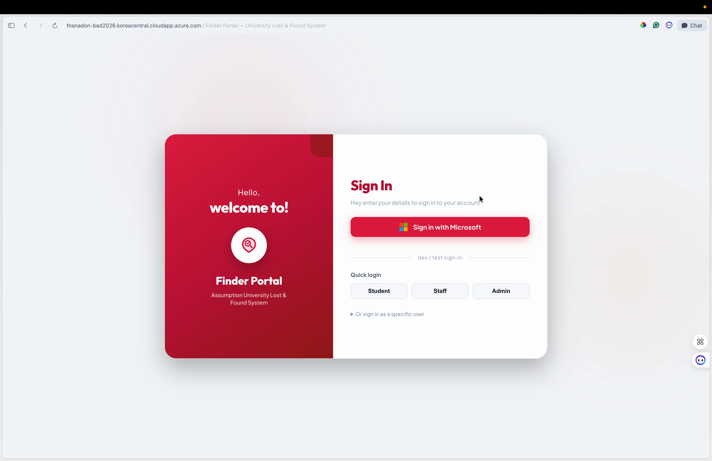
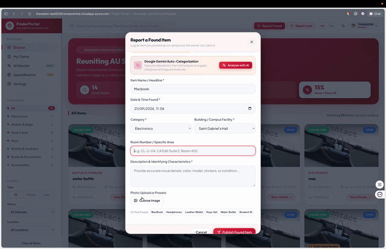
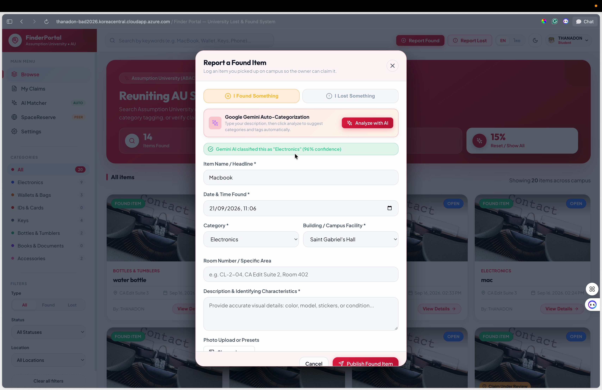
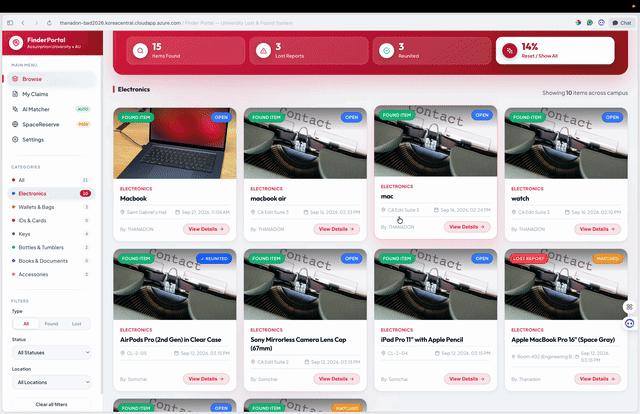
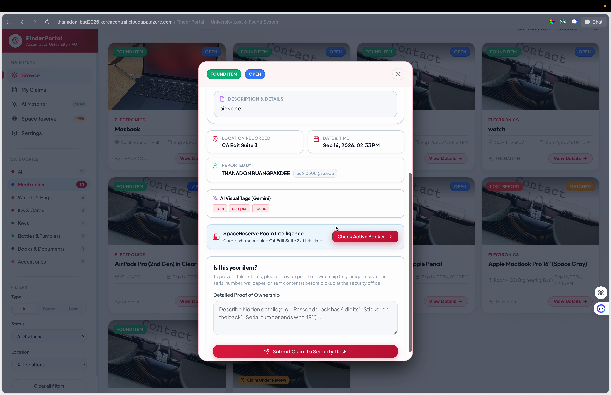
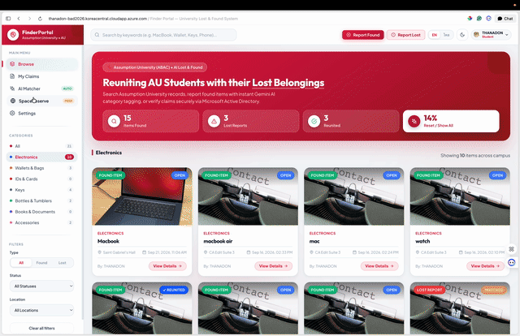
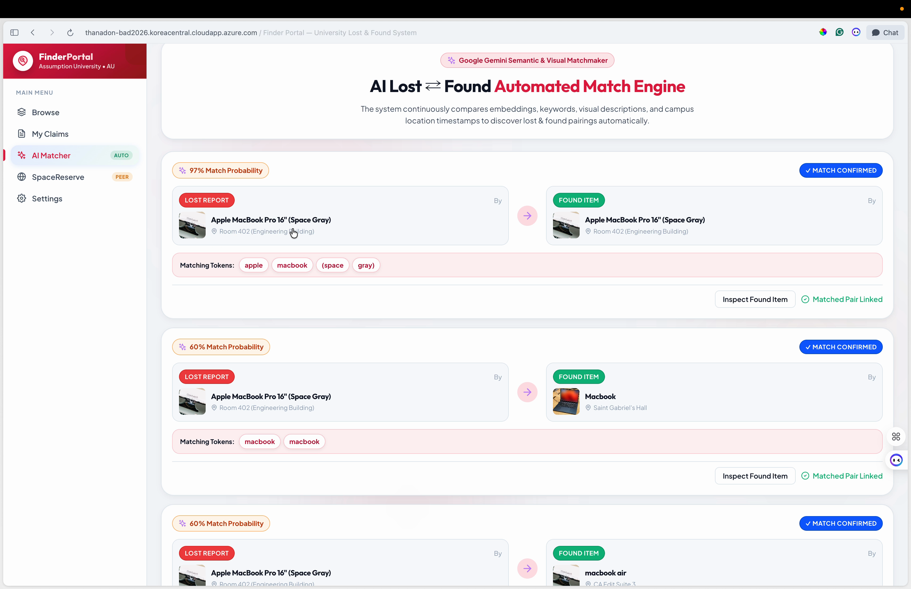

# 🔍 FinderPortal — AU Campus Lost & Found System

> **Course:** CSX4110 Business Application Development  
> **Institution:** Assumption University of Thailand (ABAC)  
> **Live Production Application:** [https://thanadon-bad2026.koreacentral.cloudapp.azure.com/project/](https://thanadon-bad2026.koreacentral.cloudapp.azure.com/project/)

---

## 👥 Team Members

| Student ID | Full Name | 
| :--- | :--- | 
| **6610308** | **Thanadon Ruangpakdee** | 
| **6610936** | **Thanakrit Kodklangdon** | 
| **6610387** | **Kitirat Pisithaporn** |

---

## 📽️ Interactive Feature Walkthrough (GIF Demos & Screenshots)

### 1. Single Sign-On & Discovery Feed
Authentication via Microsoft Entra ID (OIDC OAuth2 SSO) into a modern Crimson Glassmorphism UI with real-time keyword search, category, location, and status filtering.


*Figure 1: Microsoft SSO & Real-Time Discovery Feed*


*Figure 2: Discovery Feed High-Resolution View*

---

### 2. Google Gemini AI Vision Tagging & Auto-Classification
Upload item photos to automatically analyze visual features using **Google Gemini 1.5/2.0 Flash Vision API**, extracting metadata tags and auto-selecting item categories.


*Figure 3: Gemini Multimodal AI Auto-Tagging Flow*


*Figure 4: AI Analysis & Item Reporting Modal*

---

### 3. SpaceReserve Bilateral Peer API (Room Intelligence)
Interoperable Service-to-Service REST API integrated with **SpaceReserve** (Campus Room Booking System). Click **"Check Active Booker"** to query active room reservations at the exact timestamp an item was found.


*Figure 5: SpaceReserve Active Booker Resolution (`🟢 Active Booking Found`)*


*Figure 6: Live SpaceReserve Room Intelligence Result*

---

### 4. AI Matcher Engine & Teacher Verification Dashboard
Automated NLP matching algorithm calculates similarity scores between unresolved Lost reports and newly logged Found items, allowing faculty members to verify ownership proof and approve claims.


*Figure 7: AI Matcher Similarity Scoring & Teacher Claim Approval*


*Figure 8: Teacher/Admin Management Dashboard*

---

## 🌟 Core System Features

- 🔐 **AU Microsoft Active Directory SSO & Role-Based Access Control**:
  - 3 distinct user roles: `STUDENT`, `TEACHER`, and `ADMIN`.
  - Enforces `authenticateToken` and `requireRole` middleware with verified `@au.edu` credentials.

- 🤖 **Gemini AI Visual Tagging & Auto-Classification**:
  - Multimodal Vision API automatically generates item tags and assigns categories (*Electronics*, *Wallets & Bags*, *IDs & Cards*, *Keys*, *Bottles & Tumblers*, *Books & Documents*, *Accessories*).

- 🔑 **Azure Key Vault Central Secret Management**:
  - Secure runtime authentication using `@azure/keyvault-secrets` and `DefaultAzureCredential` to load secrets like `DATABASE_URL` and `JWT_SECRET` directly in memory without plaintext `.env` storage.

- 📍 **Bilateral Peer API Integration (SpaceReserve)**:
  - **Expose:** `GET /api/v1/items/by-location` protected via `x-api-key`.
  - **Consume:** `POST /api/v1/peer/check-bookings` sending authenticated requests to SpaceReserve `/external/bookings/active-at`.

- 🛡️ **Proof of Ownership Claim Verification Flow**:
  - Students submit hidden ownership proof (passcodes, serial numbers, unique scratches).
  - Teachers review and approve claims, updating item status to `CLAIMED`.

---

## 🛠️ Tech Stack & Architecture

- **Frontend**: React.js (Vite), Custom Crimson Glassmorphism CSS System, Lucide Icons
- **Backend**: Node.js, Express.js, TypeScript, Prisma ORM, SQLite (`dev.db`)
- **AI Engine**: Google Gemini 1.5/2.0 Flash Vision API
- **Cloud & DevOps**: Azure Key Vault, Azure VPS, Docker & Docker Compose, Nginx Reverse Proxy with Let's Encrypt SSL/TLS

---

## 🌐 Bilateral Peer API Specification

### 1. Consumed Endpoint (SpaceReserve Integration)
- **Partner System**: **SpaceReserve** (Campus Facility Booking System)
- **Endpoint Consumed**: `GET /external/bookings/active-at?room={roomLocation}&at={timestamp}`
- **Authentication Header**: `x-api-key: {THEIR_PEER_API_KEY}`
- **Response Format**: `{"room":"CA Edit Suite 3", "reservation":{"organizer":{"name":"WARACHAI ARANCHOT", "email":"u6610996@au.edu"}}}`

### 2. Exposed Endpoint (For Campus Partners)
- **Endpoint Exposed**: `GET /api/v1/items/by-location`
- **Query Parameters**: `location` (required), `since` (optional)
- **Authentication Header**: `x-api-key: {MY_PEER_API_KEY}`
- **Response Data**: Active found items recorded at that room location (`id`, `title`, `description`, `category`, `location`, `createdAt`).

---

## 🚀 Local Development Setup

### Prerequisites
- **Node.js**: v18.0.0 or higher
- **npm**

### 1. Install Dependencies
```bash
git clone https://github.com/Thanadon-Ruangpakdee/finder-portal.git
cd finder-portal

# Install Frontend & Backend Dependencies
npm run install-all
```

### 2. Start Development Servers
```bash
# Start Backend REST API Server (Port 5001)
npm run dev --prefix backend

# Start Frontend Dev Server (Port 5173)
npm run dev --prefix frontend
```

Access the application locally at: **`http://localhost:5173/project/`**

---

## 🐳 Docker Deployment

To build and launch the production container environment:

```bash
docker compose up -d --build
```

---

© 2026 **FinderPortal Team** — Assumption University of Thailand (ABAC)
