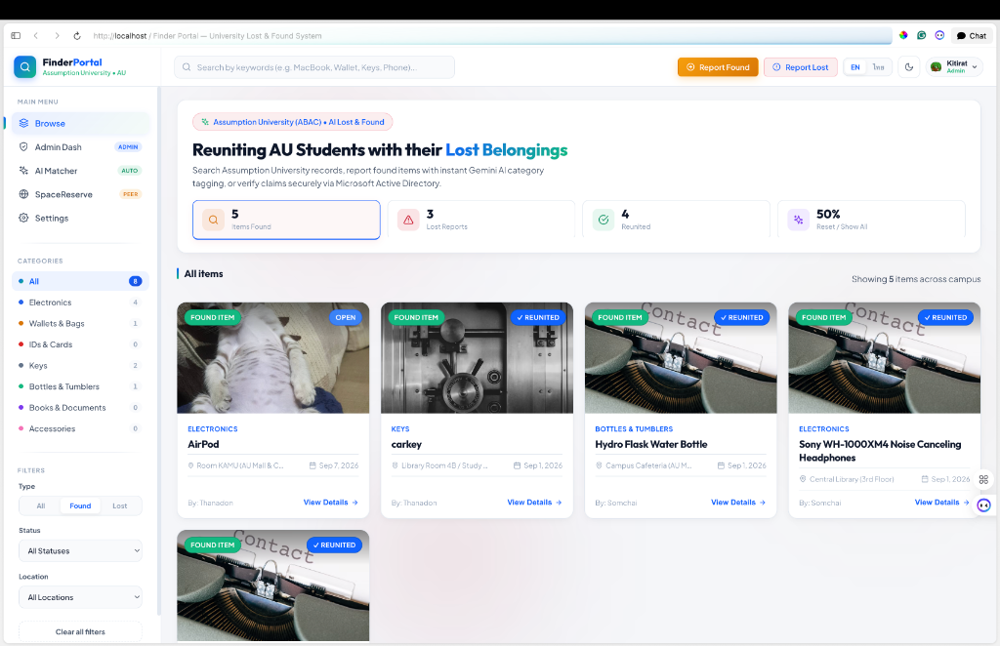
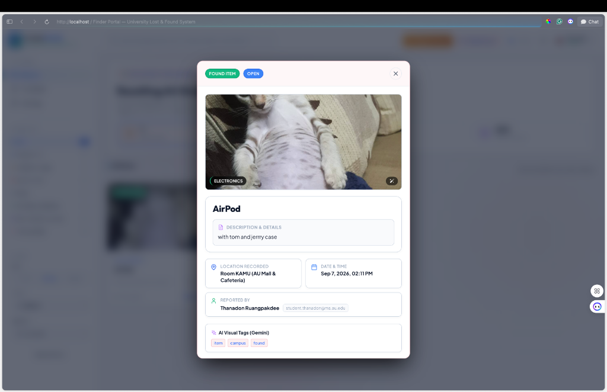

# 🔍 FinderPortal — AU Campus Lost & Found System

> **FinderPortal** is an intelligent, secure, and modern Lost & Found Management System designed specifically for **Assumption University (ABAC)** students, faculty, and campus security officers. The portal leverages **Google Gemini AI** for automated visual tagging and item classification, integrates with **Microsoft Active Directory (AD SSO)** for secure identity verification, and features interactive claim verification workflows.

---

## 👥 Team Members

| Student ID | Full Name | Role & Responsibility |
| :--- | :--- | :--- |
| **6610308** | **Thanadon Ruangpakdee** | Full-Stack Developer & UI/UX Architect |
| **6610936** | **Thanakrit Kodklangdon** | Backend Engineer & Database Systems |
| **6610387** | **Kitirat Pisithaporn** | System Integrator & DevOps |

---

## 🌟 Key Features

- 🔐 **AU Microsoft Active Directory SSO & Role-Based Access Control**:
  - Supports 3 distinct user roles: **Student**, **Teacher/Staff**, and **Admin**.
  - Securely displays reporter identity and verified AU student email credentials (`@student.uni.edu` / `@ms.au.edu`) to prevent false claims.

- 🤖 **Gemini AI Visual Tagging & Auto-Classification**:
  - Powered by **Google Gemini AI** to automatically analyze item photos and descriptions.
  - Automatically generates metadata tags (AI Visual Tags) and classifies items into categories (*Electronics*, *Wallets & Bags*, *IDs & Cards*, *Keys*, *Bottles & Tumblers*, *Books & Documents*, *Accessories*).

- 📸 **Multi-Photo Carousel & Fullscreen Lightbox Viewer**:
  - Supports multiple attached photos per report with smooth navigation arrows (`<` / `>`) and pagination dots.
  - Click any photo to expand into a high-definition **Glassmorphism Lightbox Modal** with keyboard controls (`←` / `→` / `Esc`) and thumbnail filmstrip navigation.

- 📍 **SpaceReserve Peer API Integration (Room Intelligence)**:
  - Connects with campus room scheduling services to check room reservation logs at the time an item was lost or found.

- 🛡️ **Proof of Ownership Claim Verification System**:
  - Allows students to submit hidden proof of ownership (e.g., passcode lock pattern, serial numbers, specific stickers).
  - Staff and teachers review, approve, or reject claims via the Staff Management Dashboard.

- 🔔 **"Did You Find This Lost Item?" Action Workflow**:
  - Enables helpful campus members viewing a **Lost Report** to submit details on where they turned the item in (e.g., *"Left at Security Desk, CL Building 1st Floor"*), instantly notifying the owner and security staff.

- 📊 **Organized Status & Feed Separation**:
  - Clearly segregates **Active Found Items**, **Lost Reports**, and **Reunited (Claimed)** items to prevent clutter.

---

## 📸 App Screenshots

### 1. Main Dashboard & Filter Feed


### 2. Item Detail Modal & Crisp Card Layout


---

## 🛠️ Tech Stack & Architecture

- **Frontend**: React.js (Vite), Vanilla CSS (Custom Design System & Tokens), Lucide Icons
- **Backend**: Node.js, Express.js, TypeScript, Prisma ORM, PostgreSQL
- **AI Integration**: Google Gemini AI API (Multimodal Vision & Text Analysis)
- **Cloud & Infrastructure**: Azure Key Vault (Centralized Secret Management), Azure Virtual Machines, Docker & Docker Compose

---

## 🌐 Peer API Documentation

### 1. Consuming Classmate's Peer API
- **Partner System**: **SpaceReserve** (Campus Room & Facility Reservation System)
- **Endpoint Consumed**: `GET /external/bookings/active-at?room={roomLocation}&at={timestamp}`
- **Authentication Header**: `x-api-key: {SPACE_RESERVE_PEER_KEY}`
- **Data Fetched**: Active room reservation logs, booker name, student email, and reservation time frame.
- **Application Purpose**: Correlates lost item report locations with room reservation logs to identify occupants who scheduled the room at the exact time an item went missing.

### 2. Exposed Endpoint for Classmates
- **Endpoint Exposed**: `GET /api/v1/peer/found-items`
- **Query Parameters**: `location` (string, required), `since` (ISO Date string, optional)
- **Authentication Header**: `x-api-key: {FINDER_PORTAL_PEER_KEY}`
- **Data Provided**: List of active unclaimed found items recorded at that location (`id`, `title`, `description`, `category`, `location`, `createdAt`).
- **Application Purpose**: Allows partner campus applications (e.g. SpaceReserve) to query whether items were found inside a room before a student checks into their reserved study pod/lab.

## 🚀 How to Run Locally

### Prerequisites
- **Node.js**: v18.0.0 or higher
- **npm** or **yarn**

### 1. Install Dependencies
```bash
# Clone the repository
git clone https://github.com/Thanadon-Ruangpakdee/finder-portal.git
cd finder-portal

# Install Frontend & Backend Dependencies
npm run install-all
```

### 2. Start Development Servers
```bash
# Start Backend REST API Server (Port 5001)
npm run dev --prefix backend

# Start Frontend Dev Server (Port 5173)
npm run dev --prefix frontend
```

Access the application in your browser at: **`http://localhost:5173/project/`**

---

## 🐳 Docker Deployment

To build and run the production environment using Docker Compose:

```bash
docker compose up -d --build
```

---

© 2026 **FinderPortal Team** — Assumption University of Thailand (ABAC)
