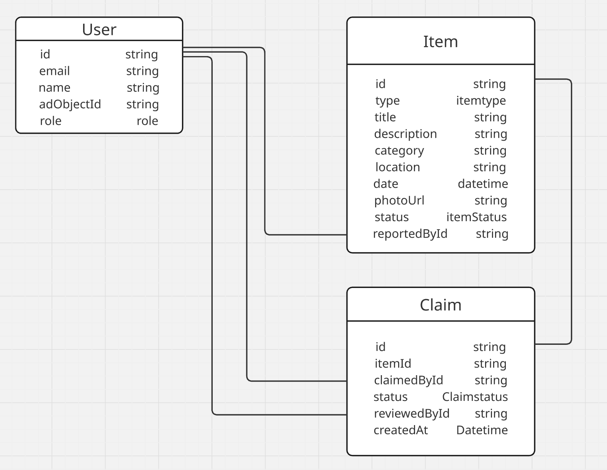
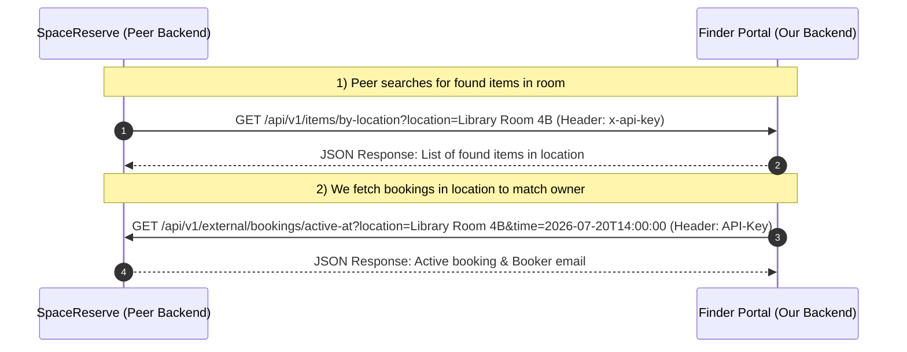

# System Design Document & Proposal: Finder Portal

**Course Code:** CSX4110  
**Project Name:** Finder Portal (Project 01: Comprehensive Backend System)  
**Team Members:**  
Thanadon Ruangpakdee 6610308  
Kitirat Pisithaporn 6610387  
Thanakrit Kodklangdon 6610936  
**Submission Date:** July 22, 2026  

---

## 1. Project Domain & Overview
On a large university campus, lost property events occur daily. Currently, the university handles lost items in a highly fragmented manner: items are handed to scattered security offices, administrative desks, or advertised casually on public social media groups. This lack of centralized record-keeping creates immense friction for students and faculty searching for their belongings.

The **Finder Portal** is a centralized web platform designed to streamline reporting, cataloging, searching, and returning lost and found items. By providing a searchable digital log, automating categorization via artificial intelligence, and establishing secure service-to-service communication with existing campus systems, the portal minimizes processing times and maximizes matching success rates.

---

## 2. Core Features
1. **Report Lost Item:** Users can submit detailed descriptions, approximate locations, dates, and item categories.
2. **Report Found Item:** Finders can submit details, upload a photo, specify location, and log items.
3. **Search & Filter:** Users can browse recent listings and search records by keywords, categories, dates, and locations.
4. **Submit Claim Request:** Allows students/faculty to request item retrieval by submitting detailed claims (describing identifying features not visible in the public listing photo). Staff will verify proof and confirm returns.
5. **AI-assisted Matching & Categorization:** The system uses Gemini/OpenAI API to automatically analyze images or textual descriptions to assign appropriate categories and flag potential matching pairs.
6. **Admin/Staff Dashboard:** Provides security/reception office staff with metrics on resolved/unresolved cases, claim trends, and pending claims.

---

## 3. User Roles & Role-Based Access Control (RBAC)
Users will authenticate via OIDC using the University's Microsoft Active Directory (AD). Based on OIDC claims, users are mapped to the following RBAC roles:

| Role | Authorized Permissions |
| :--- | :--- |
| **Student / Faculty** | - Report lost and found items. - View personal reporting history. - Submit claims on found items. |
| **Staff** *(security / front-desk)* | - View all records. - Verify claims and approve/reject them. - Update item statuses (e.g., mark as claimed). |
| **Admin** | - Manage user configurations. - View dashboard analytics & statistics. - Delete inappropriate or spam listings. |

---

## 4. Database Schema (Prisma ORM ERD)
The database represents a normalized relational schema for Finder Portal:

---

## 5. External & AI Integration
1. **Google Gemini AI API (Multimodal):**
   * **Category Tagging:** Analyzes images of uploaded found items or textual descriptions to automatically classify items under appropriate categories, reducing human categorization error.
   * **Match Recommendation:** Compares records between the `LOST` and `FOUND` domains using text embeddings and image similarities, flagging matching probabilities for admin review.
2. **SendGrid Email API / Line Notify:**
   * Sends automatic transactional notifications to the owner's university email when their claim status shifts from `PENDING` to `APPROVED` or `REJECTED`.

---

## 6. Peer API Integration (Service-to-Service)
Our application will integrate with **SpaceReserve** (peer project) to exchange operational data:

### 1) Exposed Endpoint (Service Provided to SpaceReserve)
*   **Endpoint:** `GET /api/v1/items/by-location`
*   **Header:** `x-api-key: <static_api_key_we_issue_to_spacereserve>`
*   **Function:** Allows SpaceReserve to fetch all found items logged in a specific room (via `?location=RoomName`) so they can alert students checking in if any lost items were recently found there.

### 2) Consumed Endpoint (Service Pulled from SpaceReserve)
*   **Endpoint:** `GET /api/v1/external/bookings/active-at`
*   **Header:** `Authorization: Bearer <api_key_issued_by_spacereserve>`
*   **Function:** When an item is found, we query SpaceReserve's API to fetch the booking details of who occupied that room at that time (via `?location=Library Room 4B&time=2026-07-20T14:00:00`), enabling us to notify the likely owner directly.
